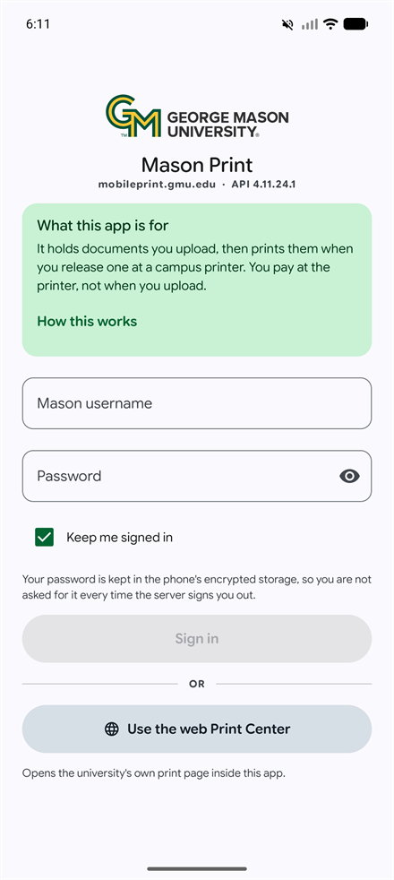
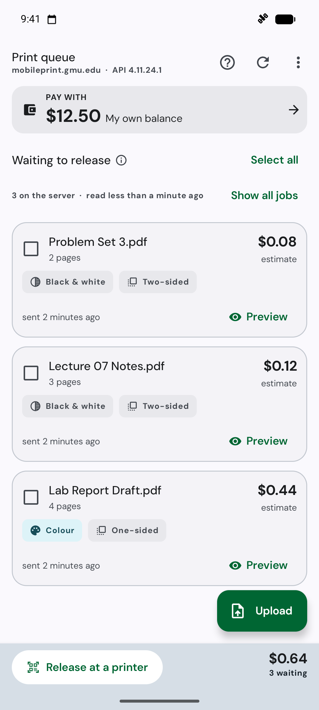
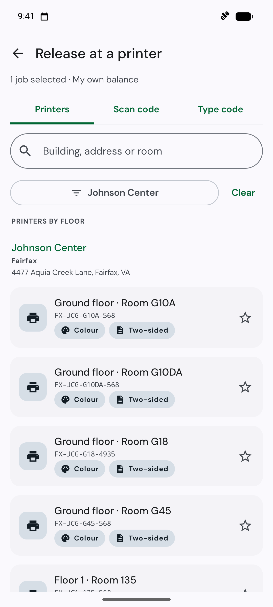
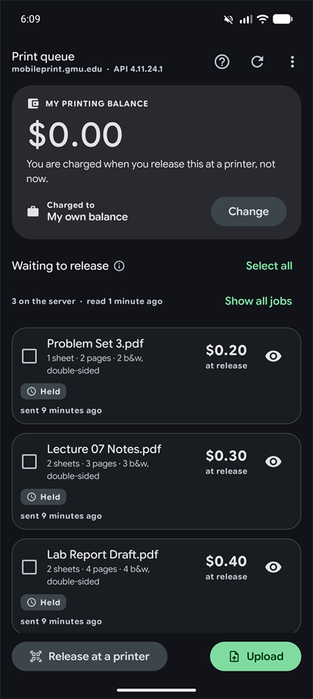

<a name="readme-top"></a>

<div align="center">


# Mason Print

A fast, native Android client for George Mason University's Pay-for-Print service.<br/>
Send documents from your phone, walk to any campus printer, scan its code, and pay only for the pages that actually come out.

**[Releases][releases-link]** · [Building from source](#%EF%B8%8F-building-from-source) · [Report an issue][issues-link]

<!-- SHIELDS GROUP -->

[![][release-shield]][releases-link]
[![][platform-shield]][platform-link]
[![][minsdk-shield]][minsdk-link]<br/>
[![][kotlin-shield]][kotlin-link]
[![][compose-shield]][compose-link]
[![][ci-shield]][ci-link]
[![][downloads-shield]][releases-link]
[![][license-shield]][license-link]

<table>
  <tr>
    <td align="center"><b>Sign in</b></td>
    <td align="center"><b>Print queue</b></td>
    <td align="center"><b>Pick a printer</b></td>
    <td align="center"><b>Dark theme</b></td>
  </tr>
  <tr>
    <td></td>
    <td></td>
    <td></td>
    <td></td>
  </tr>
</table>

<sub>Screenshots use sample documents and balances.</sub>

</div>

> \[!NOTE]
> Unofficial. Mason Print is not affiliated with, endorsed by, or supported by George Mason University or Pharos Systems. It is an independent client that speaks the same public `/PharosAPI` your campus already exposes to its own web portal, written from observed behavior of that API. Your credentials go to GMU and nowhere else.

<details>
<summary><kbd>Table of contents</kbd></summary>

#### TOC

- [✨ Features](#-features)
- [📦 Installation](#-installation)
- [🖨️ How a print actually works](#%EF%B8%8F-how-a-print-actually-works)
- [🧭 What it connects to](#-what-it-connects-to)
- [🔒 Privacy and permissions](#-privacy-and-permissions)
- [🧰 Tech stack](#-tech-stack)
- [⌨️ Building from source](#%EF%B8%8F-building-from-source)
- [🚀 Cutting a release](#-cutting-a-release)
- [🗺️ Known limits](#%EF%B8%8F-known-limits)
- [🤝 Contributing](#-contributing)
- [📝 License](#-license)
- [🙏 Acknowledgements](#-acknowledgements)

</details>

## ✨ Features

### `1` Send a whole stack at once

Pick several files in one trip through the system picker, or push them in from any app's share sheet. Pharos has no batch upload endpoint, so the app sends them one after another and reports each file on its own row with its own verdict. One rejected document does not cost you the other five.

### `2` The price, before you spend it

Every queued job shows what it will cost once the server has finished counting its pages. Select a few and the bottom bar totals them. A job whose analysis has not finished says so instead of showing a confident zero, because "0 pages" and "not priced yet" are different facts and the server reports them the same way.

### `3` Scan the printer, not the screen

Point the camera at the sticker on any campus printer and the release screen resolves it to that device. Codes scanned by Google Lens or the stock camera app work too, through a deep link. Prefer typing? The keypad tab takes the code printed on the panel.

### `4` Look before you print

Open any queued document and page through it, rendered on device with the framework PDF renderer. Nothing leaves the phone to produce the preview.

### `5` Funding that remembers you

If you always charge a department, say so once. The choice is stored per account and re-applied at your next sign-in, so a warm start never flashes "my own balance" at someone who never uses it. Sign out and back in and it comes back.

### `6` A searchable statement

Your transaction history is its own tab with a search box over what is already loaded. It matches what a student would actually search by: a document name, a printer, a date, an amount.

### `7` Printers grouped by where they are

Three hundred devices are a wall of names until they are grouped. The picker infers building and floor from the station code and puts the filter on its own screen, so the list stays a list.

### `8` Material 3 Expressive, light or dark

Independent of the system setting, because the app's theme is its own choice. The window background, the status bar, and the navigation bar all follow it, including on the very first frame.

### `9` Diagnostics that do not lie

Every request, its status, and the server's own wording for a failure. When a campus server answers HTTP 300 for a wrong password, or 401 for a route that does not exist, the screen says what happened rather than translating it into something friendlier and less true.

<div align="right">

[![][back-to-top]](#readme-top)

</div>

## 📦 Installation

Grab the signed APK from the [latest release][releases-link] and install it. You may need to allow installs from unknown sources for whichever app you download with.

Requires **Android 8.0 (API 26)** or newer. The release APK is about 3 MB and universal, so there is one file for every phone.

> \[!TIP]
> The barcode model is delivered by Google Play Services rather than bundled, which is most of why the download is small. Play Services fetches it at install time, so the first scan at a printer does not wait on it.

<div align="right">

[![][back-to-top]](#readme-top)

</div>

## 🖨️ How a print actually works

Worth knowing before you use it, because the money moves later than most people expect.

1. **Send.** The document uploads to the print server and joins your queue. Nothing is charged.
2. **Wait a moment.** The server converts it, counts the pages, and prices it. The queue re-checks for a short while on its own, since Pharos never pushes an update when a job finishes being priced.
3. **Choose.** Select the jobs you want and pick a funding source: your own balance, or a department cost center if you have one.
4. **Release.** At the printer, scan its code. The pages come out and **that** is when you are charged.

Deleting a job before you release it costs nothing, because nothing was ever spent.

<div align="right">

[![][back-to-top]](#readme-top)

</div>

## 🧭 What it connects to

The app asks for a host at first launch and suggests `mobileprint.gmu.edu`, which is the deployment it was built and verified against.

Any Pharos Uniprint server exposing `/PharosAPI` is a plausible target, and the connect screen will let you try one. Treat that as unverified: deployments differ in which capabilities they publish, how they spell their errors, and whether they allow uploads at all, and the only campus this has been driven against end to end is GMU.

If your campus uses a single sign-on page rather than a password prompt, the app hands off to it in a web view and comes back with the session.

<div align="right">

[![][back-to-top]](#readme-top)

</div>

## 🔒 Privacy and permissions

Three permissions, and that is the whole list.

| Permission | Why |
| --- | --- |
| `INTERNET` | Talk to your campus print server. There is no other network destination. |
| `ACCESS_NETWORK_STATE` | Tell "you are offline" apart from "the server refused you". |
| `CAMERA` | Scan the code on a printer. Declared optional, so a phone without a camera still installs, and the app works without ever granting it. |

There is no analytics SDK, no crash reporter, no ad library, and no `com.android.vending.BILLING`. The app has exactly one server to talk to, and it is your campus's.

Your username, password, and session cookies live in `EncryptedSharedPreferences` (AES-256-GCM with the key held by the Android keystore), and backup and device transfer are switched off for that file. On the handful of OEM builds where the encrypted store throws after a key invalidation, the app degrades to private storage rather than refusing to launch, and says so on the Diagnostics screen instead of quietly weakening itself.

Campus print servers are often served with internally issued certificates. Rather than accept every certificate silently, the app prompts once with the fingerprint and records your decision.

<div align="right">

[![][back-to-top]](#readme-top)

</div>

## 🧰 Tech stack

| Layer | Choice |
| --- | --- |
| Language | Kotlin 2.4 |
| UI | Jetpack Compose, Material 3 Expressive |
| Type | DM Sans, variable, with tabular figures on every price |
| Navigation | A hand-written back stack. 17 routes and one `when`, no Navigation Compose. |
| DI | A hand-written `AppGraph`. No Hilt. |
| HTTP | OkHttp 5, with hand-rolled JSON parsing because this API is inconsistent about casing |
| JSON | kotlinx.serialization for the parts that are consistent |
| Camera | CameraX plus unbundled ML Kit barcode scanning |
| Storage | `EncryptedSharedPreferences` for secrets, plain preferences for settings |
| Tests | 231 pure-JVM JUnit 4 tests. No Robolectric, no instrumentation. |

The dependency list is deliberately short. Every library here earns its place by being on a path the app actually takes.

<div align="right">

[![][back-to-top]](#readme-top)

</div>

## ⌨️ Building from source

```bash
git clone https://github.com/ahnafnafee/mason-print.git
cd mason-print
./gradlew :app:assembleDebug
```

Tests and lint, which is what CI runs:

```bash
./gradlew :app:testDebugUnitTest :app:lintDebug :app:assembleDebug
```

A release build works without any signing setup and falls back to the debug key:

```bash
./gradlew :app:assembleRelease
```

To sign it with a real key instead, put a `keystore.properties` at the repo root. It is gitignored, and its absence is what selects the fallback above.

```properties
storeFile=release.jks
storePassword=...
keyAlias=...
keyPassword=...
```

> \[!IMPORTANT]
> `assembleRelease` succeeding is a compile-time fact, not evidence the app runs. R8 has broken the ML Kit barcode client in release builds while the build stayed green. Install the release APK and open the Scan tab before you ship one.

<div align="right">

[![][back-to-top]](#readme-top)

</div>

## 🚀 Cutting a release

Releases are manual. Run the **Release** workflow from the Actions tab with a semver version and user-facing release notes. Explain what changed for someone using the app, including relevant fixes and any upgrade steps. The workflow rejects blank notes before building; the generated changelog follows the written summary. See the [release-note archive and writing guide](docs/releases/README.md) for examples.

The workflow refuses the version if it is not `MAJOR.MINOR.PATCH`, if that tag already exists, or if it is not strictly higher than the latest one. `versionCode` is derived as `MAJOR*10000 + MINOR*100 + PATCH`, so it cannot go backwards. That matters more here than it would on Play: Android refuses to install an APK whose `versionCode` is below the installed one, and a sideloaded app has nothing else keeping upgrades in order.

It then runs the tests, builds a signed APK, verifies the signature is not the debug key, checks 16 KB alignment, and publishes the release with the APK attached.

Four repository secrets are required, under Settings, then Secrets and variables, then Actions:

| Secret | What |
| --- | --- |
| `RELEASE_KEYSTORE_BASE64` | base64 of the release keystore (`.jks`) |
| `RELEASE_STORE_PASSWORD` | keystore store password |
| `RELEASE_KEY_ALIAS` | key alias |
| `RELEASE_KEY_PASSWORD` | key password |

All four are mandatory. An existing install can only be upgraded in place by an APK signed with the same key, so a release signed with anything else would strand everyone already running it.

<div align="right">

[![][back-to-top]](#readme-top)

</div>

## 🗺️ Known limits

- **The release tap itself is not verified end to end.** Every other call has been driven against a live GMU account, but triggering an actual release spends real money and real paper. The code path is written and tested against captured responses; it has not printed a page.
- **Cost center search is server-ignored.** GMU returns the same response whatever you type in the search box. The screen says so rather than pretending to filter.
- **One campus.** Only `mobileprint.gmu.edu` has been exercised.
- **No background refresh.** The queue updates when the app is open. There is no WorkManager job and no foreground service.
- **English only.**

<div align="right">

[![][back-to-top]](#readme-top)

</div>

## 🤝 Contributing

Issues and pull requests are welcome. CI runs unit tests, lint, and a debug build on every push and pull request to `main`; keep it green.

<div align="right">

[![][back-to-top]](#readme-top)

</div>

## 📝 License

[MIT](LICENSE) © Ahnaf An Nafee

## 🙏 Acknowledgements

Built on [Jetpack Compose][compose-link] and [Material 3 Expressive](https://m3.material.io/), with [OkHttp](https://square.github.io/okhttp/) doing the talking.

Set in [DM Sans](https://fonts.google.com/specimen/DM+Sans) by Colophon Foundry, Jonny Pinhorn and Indian Type Foundry, used under the SIL Open Font License ([full text](licenses/DMSans-OFL.txt)).

"George Mason University" and "Pharos" are the marks of their respective owners and are used here only to say what this app talks to.

<div align="right">

[![][back-to-top]](#readme-top)

</div>

[back-to-top]: https://img.shields.io/badge/-BACK_TO_TOP-151515?style=flat-square
[ci-link]: https://github.com/ahnafnafee/mason-print/actions/workflows/ci.yml
[ci-shield]: https://img.shields.io/github/actions/workflow/status/ahnafnafee/mason-print/ci.yml?branch=main&label=CI&style=flat-square
[compose-link]: https://developer.android.com/jetpack/compose
[compose-shield]: https://img.shields.io/badge/Jetpack%20Compose-Material%203%20Expressive-4285F4?logo=jetpackcompose&logoColor=white&style=flat-square
[downloads-shield]: https://img.shields.io/github/downloads/ahnafnafee/mason-print/total?label=Downloads&style=flat-square&color=006633
[issues-link]: https://github.com/ahnafnafee/mason-print/issues
[kotlin-link]: https://kotlinlang.org
[kotlin-shield]: https://img.shields.io/badge/Kotlin-2.4-7F52FF?logo=kotlin&logoColor=white&style=flat-square
[license-link]: LICENSE
[license-shield]: https://img.shields.io/badge/License-MIT-yellow.svg?style=flat-square
[minsdk-link]: https://developer.android.com/about/versions/oreo
[minsdk-shield]: https://img.shields.io/badge/Min%20SDK-26%20(Android%208.0)-3DDC84?style=flat-square
[platform-link]: https://www.android.com
[platform-shield]: https://img.shields.io/badge/Platform-Android-3DDC84?logo=android&logoColor=white&style=flat-square
[release-shield]: https://img.shields.io/github/v/release/ahnafnafee/mason-print?sort=semver&style=flat-square&color=FFCC33
[releases-link]: https://github.com/ahnafnafee/mason-print/releases/latest
